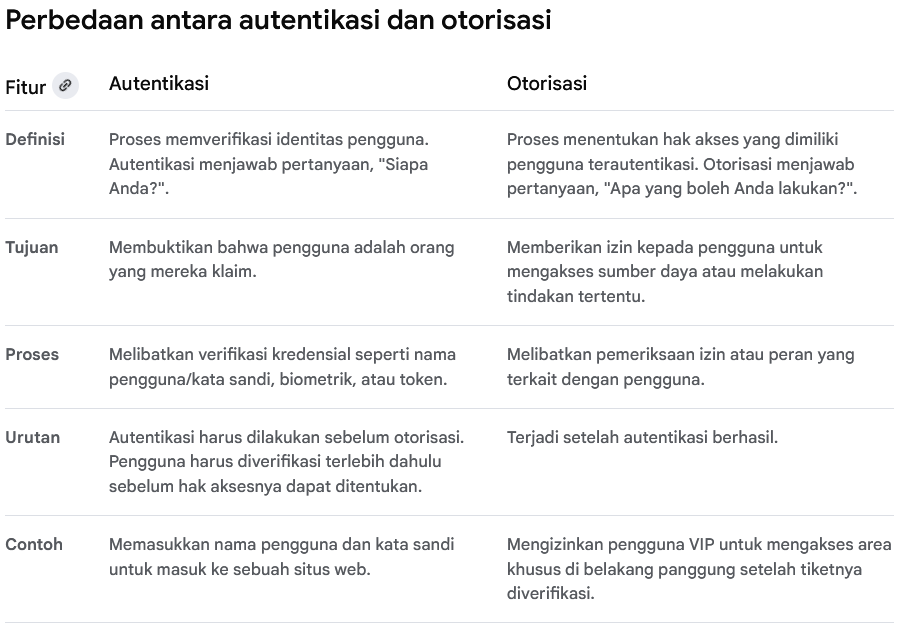
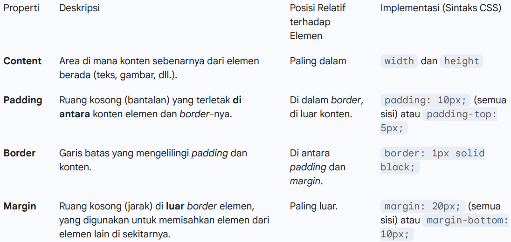

Tugas 2:
1. Jelaskan bagaimana cara kamu mengimplementasikan checklist di atas secara step-by-step (bukan hanya sekadar mengikuti tutorial).
   Jawab: 
   pada tahap awal, saya membuat repositori baru di github dengan nama saikhahstation untuk menyimpan seluruh kode proyek. setelah itu, saya menyiapkan lingkungan kerja dengan menginstal django serta beberapa dependensi lain yang dibutuhkan. selanjutnya, saya membuat proyek django bernama saikhahstation sekaligus menambahkan aplikasi utama bernama main. di aplikasi tersebut, saya mulai mendefinisikan model yang relevan dengan kebutuhan proyek, seperti model produk yang memuat atribut nama, harga, deskripsi, kategori, dan lain-lain.

   setelah model selesai dibuat, saya menghubungkannya dengan view agar data dapat diproses dan kemudian ditampilkan melalui template. saya juga menyusun konfigurasi routing dengan menambahkan path pada urls.py, sehingga setiap permintaan dari pengguna dapat diarahkan ke view yang sesuai. untuk memastikan aplikasi berjalan dengan baik, saya melakukan migrasi basis data dan menjalankan server secara lokal, lalu memverifikasi bahwa halaman dapat diakses melalui browser.

   tahap berikutnya adalah pengaturan variabel lingkungan. saya membuat berkas .env untuk kebutuhan pengembangan lokal dan menyiapkan konfigurasi berbeda untuk mode produksi. dengan cara ini, proyek tetap aman dan fleksibel, baik saat dijalankan di komputer pribadi maupun ketika dideploy ke server. setelah semuanya selesai, saya melakukan commit perubahan, mendorongnya ke github, dan menyiapkan proses deployment agar aplikasi saikhahstation dapat diakses melalui alamat publik.

   sebagai rangkuman, langkah-langkah yang saya lakukan dapat diuraikan sebagai berikut:
        1.	membuat repositori baru di github dengan nama saikhahstation.
        2.	menginstal django.
        3.	membuat proyek django bernama saikhahstation.
        4.	menambahkan aplikasi utama bernama main.
        5.	mendefinisikan model produk pada models.py.
        6.	menghubungkan model dengan view dan template.
        7.	mengatur routing di urls.py agar request terhubung ke view.
        8.	menjalankan migrasi basis data.
        9.	menguji aplikasi dengan server lokal melalui browser.
        10.	menyiapkan variabel lingkungan untuk konfigurasi lokal dan produksi.
        11.	melakukan commit dan push ke github.
        12.	menyiapkan deployment agar aplikasi dapat diakses secara publik.

2. Buatlah bagan yang berisi request client ke web aplikasi berbasis Django beserta responnya dan jelaskan pada bagan tersebut kaitan antara urls.py, views.py, models.py, dan berkas html.
   Jawab:
   
   
   Penjelasannya:
   - urls.py berfungsi sebagai pemetaan (routing) yang menghubungkan permintaan dari client ke fungsi yang sesuai pada views.py.
   - views.py bertugas memproses logika aplikasi sesuai permintaan, misalnya mengambil data dari basis data atau memanggil fungsi tertentu.
   - models.py berisi definisi struktur basis data dalam bentuk kelas. View dapat memanfaatkan model untuk melakukan operasi CRUD (Create, Read, Update, Delete) pada basis data.
   - Template HTML digunakan untuk merender data yang diproses view sehingga dapat ditampilkan kembali ke pengguna.
   - Hasil akhirnya adalah response berupa halaman web yang dikembalikan ke client.

3. Jelaskan peran settings.py dalam proyek Django!
   Jawab:
   dalam proyek django, berkas settings.py berperan sebagai pusat konfigurasi utama yang menentukan bagaimana aplikasi dijalankan, baik pada lingkungan pengembangan maupun produksi. file ini memuat berbagai pengaturan penting, seperti daftar aplikasi yang digunakan (installed apps), middleware, konfigurasi basis data, direktori template, hingga pengaturan keamanan seperti secret key dan allowed hosts. dengan kata lain, settings.py menjadi fondasi yang mengatur interaksi antar-komponen dalam proyek django.

   pada proyek saikhahstation, saya memanfaatkan settings.py untuk menghubungkan aplikasi dengan database, menambahkan aplikasi main ke dalam INSTALLED_APPS, serta mengatur template dan routing agar dapat berjalan dengan benar. selain itu, saya juga menambahkan logika pemilihan konfigurasi berdasarkan environment variables sehingga proyek dapat membedakan mode pengembangan dan produksi. hal ini menjadikan settings.py tidak hanya sebagai file konfigurasi standar, tetapi juga sebagai sarana untuk menjaga fleksibilitas dan keamanan aplikasi.

4. Bagaimana cara kerja migrasi database di Django?
   Jawab:
   migrasi merupakan mekanisme untuk menyesuaikan struktur basis data dengan model yang didefinisikan pada models.py. proses ini dilakukan dalam dua tahap:
	1.	perintah python manage.py makemigrations menghasilkan berkas migrasi berdasarkan perubahan model.
	2.	perintah python manage.py migrate mengeksekusi migrasi tersebut sehingga struktur basis data diperbarui sesuai model.

5. Menurut Anda, dari semua framework yang ada, mengapa framework Django dijadikan permulaan pembelajaran pengembangan perangkat lunak?
   Jawab:
   menurut saya alasan Django dipilih sebagai framework awal dalam pembelajaran pengembangan perangkat lunak karena menggunakan bahasa Python yang relatif mudah dipelajari. selain itu, Django menyediakan berbagai fitur bawaan seperti ORM, autentikasi, dan admin panel sehingga mahasiswa dapat lebih cepat memahami alur pengembangan aplikasi web secara menyeluruh. dokumentasi Django yang lengkap dan komunitas yang luas juga memudahkan proses pembelajaran. framework ini menerapkan konsep MVT yang melatih mahasiswa berpikir terstruktur dalam membangun aplikasi.

6. Apakah ada feedback untuk asisten dosen tutorial 1 yang telah kamu kerjakan sebelumnya?
   Jawab:
   tidak ada. 

Tugas 3:
1. Jelaskan mengapa kita memerlukan data delivery dalam pengimplementasian sebuah platform?
   Jawab:
   Data delivery adalah proses pengiriman data dari satu titik ke titik lain dalam sebuah sistem, sering kali dari server ke klien (misalnya, browser atau aplikasi seluler) atau antar microservices. Kita memerlukannya dalam pengimplementasian platform karena:
      - Menghubungkan Frontend dan Backend: Tanpa data delivery, frontend (antarmuka yang dilihat pengguna) tidak bisa mendapatkan data dari backend (logika bisnis dan database). Misalnya, sebuah aplikasi e-commerce tidak bisa menampilkan daftar produk atau riwayat pesanan tanpa proses ini.
      - Komunikasi Antar Komponen: Dalam arsitektur modern seperti microservices, data delivery memungkinkan berbagai layanan yang independen untuk berkomunikasi dan berbagi informasi. Misalnya, layanan pembayaran perlu mengirim data ke layanan manajemen stok untuk memperbarui jumlah produk yang tersedia.
      - Sinkronisasi dan Real-time Updates: Data delivery memungkinkan platform untuk memberikan pembaruan secara real-time. Contohnya adalah notifikasi, chat, atau pembaruan skor langsung di aplikasi olahraga. Tanpa ini, pengguna harus me-refresh halaman secara manual untuk melihat data terbaru.

2. Menurutmu, mana yang lebih baik antara XML dan JSON? Mengapa JSON lebih populer dibandingkan XML?
   Jawab: 
   Menurut saya, JSON (JavaScript Object Notation) lebih baik untuk sebagian besar kasus dalam pengembangan web modern, dan ini juga yang membuatnya lebih populer daripada XML (eXtensible Markup Language).

   Alasan mengapa JSON lebih populer adalah:
   - Sintaks yang Ringkas dan Mudah Dibaca: Sintaks JSON menggunakan kurung kurawal {} dan kurung siku [] yang mirip dengan objek JavaScript, membuatnya sangat mudah dibaca dan ditulis oleh manusia. Sebaliknya, XML menggunakan tag <element> yang sering kali lebih panjang dan bertele-tele.
   - Ukuran File yang Lebih Kecil: Karena sintaksnya yang ringkas, file JSON cenderung memiliki ukuran yang lebih kecil dibandingkan XML untuk data yang sama. Ini penting untuk menghemat bandwidth dan mempercepat waktu pemuatan.
   - Integrasi Native dengan JavaScript: JSON dinamai berdasarkan JavaScript. Ini berarti bahasa ini memiliki dukungan native untuk parsing JSON, sehingga pengembang dapat mengonversinya menjadi objek JavaScript dan sebaliknya dengan mudah.
   - Struktur Data yang Fleksibel: JSON mendukung struktur data dasar seperti objek, array, string, angka, dan boolean, yang sangat cocok untuk merepresentasikan data yang kompleks dan hierarkis.

   Meskipun XML masih relevan di beberapa bidang (misalnya, SOAP, RSS, dan beberapa konfigurasi industri), JSON telah menjadi standar de facto untuk pertukaran data di web karena kepraktisan dan efisiensinya.

3. Jelaskan fungsi dari method is_valid() pada form Django dan mengapa kita membutuhkan method tersebut?
   Jawab: 
   Metode is_valid() adalah metode krusial pada objek form di Django. Fungsinya adalah untuk memvalidasi data yang dikirimkan melalui form.
   Kita memerlukannya karena:
   - Pencegahan Data Rusak: Metode ini memastikan bahwa data yang dikirimkan oleh pengguna sesuai dengan tipe data yang diharapkan, format yang benar, dan memenuhi semua batasan (misalnya, panjang minimal, format email yang valid). Ini mencegah data yang tidak valid atau berbahaya masuk ke database.
   - Keamanan: Validasi ini membantu mencegah serangan dasar seperti Cross-site scripting (XSS) dengan memastikan input pengguna tidak mengandung kode berbahaya.
   - Kemudahan Pengembangan: Daripada harus menulis kode validasi manual untuk setiap field (seperti if request.POST['nama'] == ''...), is_valid() mengotomatisasi seluruh proses validasi berdasarkan definisi field di class Form. Ini membuat kode lebih bersih, terstruktur, dan mudah dikelola.
   - Pengelolaan Error: Jika form tidak valid, is_valid() akan mengembalikan False. Kita bisa mengakses atribut form.errors untuk mendapatkan pesan kesalahan yang spesifik untuk setiap field, yang kemudian dapat ditampilkan kembali kepada pengguna untuk memperbaikinya.

4. Mengapa kita membutuhkan csrf_token saat membuat form di Django? Apa yang dapat terjadi jika kita tidak menambahkan csrf_token pada form Django? Bagaimana hal tersebut dapat dimanfaatkan oleh penyerang? 
   Jawab:
   Kita membutuhkan csrf_token saat membuat form di Django untuk melindungi situs dari serangan Cross-Site Request Forgery (CSRF). CSRF adalah jenis serangan di mana penyerang memaksa pengguna yang sudah terautentikasi untuk mengirimkan permintaan HTTP berbahaya ke situs web yang rentan. Contohnya, mengirim permintaan untuk mengganti email atau melakukan transfer uang tanpa sepengetahuan pengguna.

   Apa yang Terjadi Jika Tidak Menggunakan csrf_token?
   Jika kita tidak menambahkan  pada form, Django tidak akan dapat memvalidasi permintaan POST dari pengguna. Ini membuat situs web rentan terhadap serangan CSRF.

   Bagaimana Serangan CSRF Terjadi?
   1. Pengguna A masuk ke situs bank (misalnya, bank.com) dan sesi autentikasinya disimpan di browser.
   2. Penyerang B membuat sebuah halaman web jahat (evil.com) yang berisi form tersembunyi. Form ini secara otomatis melakukan permintaan POST ke bank.com untuk melakukan transfer uang, lengkap dengan detail rekening penyerang.
   HTML

    <form action="https://bank.com/transfer" method="post">
        <input type="hidden" name="amount" value="1000">
        <input type="hidden" name="to_account" value="rekening_penyerang">
        <input type="submit" value="Kirim" style="display:none;">
    </form>
    

   3. Penyerang B kemudian membujuk Pengguna A untuk mengunjungi evil.com.
   4. Saat Pengguna A mengunjungi evil.com, form tersembunyi akan otomatis terkirim. Karena Pengguna A masih memiliki sesi yang valid di bank.com, browser akan secara otomatis menyertakan cookie sesi pengguna.
   5. Tanpa csrf_token, bank.com akan menganggap permintaan ini sah dan akan memprosesnya, sehingga uang akan terkirim ke rekening penyerang.

   Peran csrf_token dalam Mencegah Serangan:
   Ketika csrf_token digunakan, Django akan menghasilkan sebuah token unik yang dimasukkan sebagai field tersembunyi di dalam form. Ketika form disubmit, Django akan memeriksa apakah token yang dikirimkan oleh browser cocok dengan token yang ada di sesi pengguna. Jika permintaan berasal dari situs eksternal seperti evil.com, mereka tidak akan memiliki akses ke token sesi yang valid, sehingga token yang dikirimkan tidak akan cocok. Django akan menolak permintaan tersebut dengan status 403 Forbidden, efektif mencegah serangan CSRF.

5. Jelaskan bagaimana cara kamu mengimplementasikan checklist di atas secara step-by-step (bukan hanya sekadar mengikuti tutorial).
   Jawab: 
   Pertama, saya mulai dengan membuat model Product di models.py untuk mendefinisikan struktur data yang akan disimpan, misalnya nama produk, harga, dan deskripsi. Setelah itu, saya membuat form di forms.py menggunakan ProductForm agar pengguna bisa menambahkan data produk dengan lebih mudah. Selanjutnya, saya menulis function view di views.py seperti show_main, create_product, show_xml, dan show_json. View ini bertugas untuk mengambil data dari database, memprosesnya, dan mengembalikannya ke user dalam bentuk halaman HTML atau format data seperti XML/JSON. Setelah views siap, saya menghubungkannya melalui urls.py supaya setiap endpoint bisa diakses oleh pengguna, misalnya /create-product/ untuk menambahkan produk atau /json/ untuk melihat data dalam bentuk JSON. Di tahap berikutnya, saya membuat template HTML seperti main.html dan create_product.html untuk menampilkan data ke pengguna. Saya juga menambahkan csrf_token pada form supaya aman dari serangan CSRF. Terakhir, saya melakukan pengecekan apakah form yang di-submit valid dengan memanggil is_valid(). Jika valid, data akan disimpan ke database. Jika tidak valid, form akan ditampilkan kembali dengan pesan error agar pengguna bisa memperbaiki inputnya.

Mengakses keempat URL di poin 2 menggunakan Postman, membuat screenshot dari hasil akses URL pada Postman, dan menambahkannya ke dalam README.md

Tugas 4

1. Apa itu Django AuthenticationForm? Jelaskan juga kelebihan dan kekurangannya.
Jawab: 
Django AuthenticationForm adalah form bawaan yang digunakan untuk mengelola proses login pengguna. Formulir ini dirancang khusus untuk bekerja dengan sistem otentikasi (authentication system) bawaan Django, yang mencakup model User, backends, dan views. Tujuannya adalah untuk menyederhanakan proses pembuatan halaman login tanpa harus membuat formulir dari awal.

Kelebihan Django AuthenticationForm
   1. Keamanan bawaan yang kuat: AuthenticationForm sudah dilengkapi dengan fitur keamanan untuk melindungi aplikasi dari kerentanan umum seperti serangan cross-site request forgery (CSRF). Django secara default menggunakan hashing untuk menyimpan kata sandi dan tidak pernah menyimpannya dalam format teks biasa.
   2. Integrasi yang mudah: Karena merupakan bagian dari Django, formulir ini terintegrasi secara mulus dengan sistem autentikasi lainnya, seperti model User dan manajemen sesi. Pengembang tidak perlu membangun ulang fungsionalitas login dasar dari awal.
   3. Validasi otomatis: Formulir ini secara otomatis memvalidasi kredensial yang diberikan. Jika nama pengguna atau kata sandi tidak valid, formulir akan menampilkan pesan kesalahan yang relevan.
   4. Pemisahan logika: AuthenticationForm memisahkan logika validasi dan autentikasi dari tampilan (template), sehingga membuat kode lebih bersih dan mudah dipelihara. Validasi dilakukan di sisi backend, sedangkan tampilan formulir ditangani di sisi frontend.
   5. Kustomisasi yang fleksibel: Jika diperlukan, pengembang dapat dengan mudah memperluas atau mengkustomisasi AuthenticationForm untuk menambahkan bidang tambahan atau mengubah perilaku validasinya agar sesuai dengan kebutuhan proyek. 

Kekurangan Django AuthenticationForm

   1. Fungsionalitas dasar: Secara default, AuthenticationForm hanya menangani nama pengguna dan kata sandi. Untuk fitur autentikasi yang lebih canggih, seperti login dengan alamat email, autentikasi multi-faktor, atau pembatasan percobaan login (throttling), dibutuhkan kustomisasi tambahan atau penggunaan paket pihak ketiga.
   2. Keterbatasan informasi kesalahan: Saat login gagal, formulir ini tidak secara spesifik memberitahu pengguna apakah nama pengguna atau kata sandi yang salah. Ini adalah fitur keamanan untuk mencegah peretas mengetahui nama pengguna yang valid. Namun, hal ini bisa menjadi kurang informatif bagi pengguna biasa.
   3. Tidak menyediakan template: Meskipun menyediakan logika formulir dan tampilan, AuthenticationForm tidak datang dengan template HTML bawaan. Pengembang harus membuat template HTML-nya sendiri untuk merender formulir di halaman web.
   4. Kurva pembelajaran untuk kustomisasi lanjutan: Meskipun mudah untuk penggunaan dasar, mengkustomisasi model User atau proses autentikasi dapat memiliki kurva pembelajaran yang sedikit lebih curam bagi pengembang pemula, karena melibatkan pemahaman yang lebih dalam tentang arsitektur sistem autentikasi Django.

2. Apa perbedaan antara autentikasi dan otorisasi? Bagaiamana Django mengimplementasikan kedua konsep tersebut? 
Jawab: 

Implementasi autentikasi dan otorisasi di Django
1. Implementasi Autentikasi
   Sistem autentikasi Django bekerja dengan menggunakan model User, middleware, dan backend autentikasi. 

   - Model User: Django menyediakan model User bawaan yang menyimpan informasi pengguna seperti nama pengguna, kata sandi (yang di-hash dengan aman), dan alamat email.
   - Sesi dan Middleware: Saat pengguna berhasil masuk, Django membuat ID sesi dan menyimpannya di cookie pada browser pengguna. Di setiap permintaan selanjutnya, middleware autentikasi Django akan mengambil ID sesi dari cookie untuk melampirkan objek request.user ke permintaan, yang mewakili pengguna yang sedang masuk.
   - is_authenticated: Objek request.user memiliki properti is_authenticated yang akan bernilai True jika pengguna telah berhasil diautentikasi dan False jika tidak. 

2. Implementasi Otorisasi
Setelah pengguna diautentikasi, Django menyediakan mekanisme untuk memeriksa izin yang dimilikinya.
   - Permissions: Django memungkinkan pengembang untuk menetapkan izin pada model. Misalnya, izin untuk menambah (add), mengubah (change), atau menghapus (delete) objek.
   - Groups: Pengembang dapat membuat grup dan menetapkan izin ke grup tersebut. Pengguna dapat ditambahkan ke grup untuk secara otomatis mewarisi semua izin dari grup itu, yang menyederhanakan manajemen izin.
   - Metode pada Objek User: Objek request.user memiliki beberapa metode untuk pemeriksaan otorisasi:
      - user.has_perm('app_name.permission_name'): Memeriksa apakah pengguna memiliki izin tertentu.
      - user.has_perms(['app_name.permission_name', 'app_name.other_permission']): Memeriksa apakah pengguna memiliki beberapa izin.
      - user.is_staff dan user.is_superuser: Properti bawaan untuk membedakan antara pengguna staf dan administrator super, yang secara otomatis memiliki semua izin.
   - Decorators dan Mixins: Untuk membatasi akses ke view, Django menyediakan decorators seperti @login_required dan @permission_required. Ini adalah cara praktis untuk memastikan bahwa hanya pengguna yang diautentikasi atau memiliki izin tertentu yang dapat mengakses suatu tampilan. 

3. Apa saja kelebihan dan kekurangan session dan cookies dalam konteks menyimpan state di aplikasi web?
Jawab:
Cookies dan sessions adalah dua metode umum untuk menyimpan state (kondisi) di aplikasi web, namun keduanya memiliki kelebihan dan kekurangan yang berbeda.

1.  Cookies
Cookies adalah file teks kecil yang disimpan di sisi klien (browser pengguna) oleh server web. Setiap kali pengguna mengunjungi situs web yang sama, browser akan mengirimkan kembali cookies tersebut ke server.

Kelebihan Cookies:
   - Beban Server Berkurang: Cookies tidak membebani server karena data disimpan di sisi klien. Ini berguna untuk aplikasi skala besar dengan banyak pengguna.
   - Akses Offline: Sebagian data bisa diakses bahkan saat pengguna offline, asalkan cookie belum kedaluwarsa.
   - Persistensi: Cookie bisa diatur untuk bertahan lama (persistent), bahkan setelah browser ditutup, yang ideal untuk fitur "ingat saya" pada halaman login atau preferensi pengguna.

Kekurangan Cookies:
   - Keamanan: Data yang disimpan di cookie rentan terhadap serangan XSS (Cross-Site Scripting) dan CSRF (Cross-Site Request Forgery). Data sensitif seperti kata sandi tidak boleh disimpan dalam cookie.
   - Kapasitas Terbatas: Ukuran cookie dibatasi, biasanya sekitar 4 KB per domain.
   - Privasi: Beberapa pengguna mungkin menonaktifkan cookie karena alasan privasi, yang dapat menyebabkan beberapa fitur tidak berfungsi.
   - Visibilitas: Pengguna bisa melihat, memodifikasi, atau menghapus cookie.

2. Sessions
Session adalah mekanisme di mana data disimpan di sisi server, dan server hanya mengirimkan ID sesi (session ID) ke browser pengguna, biasanya dalam bentuk cookie.

Kelebihan Sessions:
   - Keamanan Tinggi: Data sesi disimpan di server, sehingga tidak bisa diakses, dilihat, atau dimodifikasi oleh pengguna. Ini membuatnya ideal untuk menyimpan data sensitif seperti status login atau isi keranjang belanja.
   - Kapasitas Tidak Terbatas: Kapasitas session dibatasi oleh kapasitas penyimpanan server, bukan oleh browser pengguna.
   - Kontrol Penuh: Pengembang memiliki kontrol penuh terhadap masa pakai dan pengelolaan data sesi.

Kekurangan Sessions:
   - Beban Server: Session membutuhkan sumber daya server (memori atau database) untuk menyimpan setiap sesi aktif, yang bisa menjadi masalah pada aplikasi berskala besar dengan ribuan atau jutaan pengguna.
   - Tidak Persisten: Secara default, sesi biasanya berakhir saat browser ditutup. Meskipun bisa dibuat persisten, ini memerlukan konfigurasi tambahan.
   - Skalabilitas: Menangani sesi di lingkungan terdistribusi atau multi-server (seperti load balancer) bisa menjadi kompleks. Semua server harus berbagi data sesi, yang membutuhkan infrastruktur tambahan seperti database atau cache eksternal (seperti Redis).

4. Apakah penggunaan cookies aman secara default dalam pengembangan web, atau apakah ada risiko potensial yang harus diwaspadai? Bagaimana Django menangani hal tersebut?
Jawab: 
Secara default, penggunaan cookies dalam pengembangan web tidak sepenuhnya aman. Meskipun cookies adalah mekanisme yang penting dan fundamental untuk fungsionalitas web modern, mereka rentan terhadap berbagai serangan jika tidak dilindungi dengan benar. Oleh karena itu, pengembang harus selalu menerapkan praktik keamanan terbaik saat menggunakannya. 

Risiko keamanan potensial pada cookies:
   1. Cross-Site Scripting (XSS): Jika aplikasi web rentan terhadap serangan XSS, penyerang dapat menyuntikkan skrip berbahaya ke halaman web. Skrip ini dapat mencuri cookies yang berisi informasi sensitif, seperti ID sesi pengguna yang terotentikasi, untuk membajak sesi tersebut.
   2. Cross-Site Request Forgery (CSRF): Penyerang dapat menggunakan cookies otentikasi pengguna yang sudah ada untuk memaksa pengguna melakukan tindakan yang tidak diinginkan di situs web lain. Django menyediakan perlindungan bawaan terhadap CSRF, tetapi pengembang harus memastikannya diimplementasikan dengan benar.
   3. Pembajakan sesi: Jika cookies sesi tidak dilindungi dan dikirim melalui koneksi yang tidak terenkripsi (HTTP), penyerang dapat mencegatnya dan menyamar sebagai pengguna yang sah.
   4. Manipulasi cookie: Karena cookies disimpan di sisi klien, pengguna dapat melihat dan memodifikasi nilainya secara langsung. Meskipun cookie sesi di Django dilindungi, pengembang harus berhati-hati agar tidak menyimpan data sensitif apa pun dalam cookie yang tidak terenkripsi.
   5. Risiko privasi: Cookies pihak ketiga digunakan untuk melacak perilaku pengguna di berbagai situs web, menimbulkan masalah privasi dan memerlukan persetujuan pengguna berdasarkan regulasi seperti GDPR. 

Bagaimana Django menangani keamanan cookie?
Django, sebagai kerangka kerja yang mementingkan keamanan, menyediakan beberapa mekanisme bawaan untuk mengurangi risiko yang terkait dengan cookies.
1. Perlindungan default pada cookies sesi
   Secara default, Django tidak menyimpan data sesi sensitif di dalam cookie itu sendiri. Sebaliknya, Django menyimpan data sesi di sisi server (misalnya, dalam basis data) dan hanya menempatkan ID sesi yang unik dan acak dalam cookie di sisi klien. Pendekatan ini secara signifikan mengurangi risiko kebocoran data sensitif. 
2. Atribut cookie yang aman
   Django menggunakan beberapa atribut cookie untuk meningkatkan keamanan, meskipun beberapa mungkin memerlukan konfigurasi eksplisit:
   - SESSION_COOKIE_HTTPONLY: Secara default disetel ke True di Django. Ini memastikan bahwa cookies sesi tidak dapat diakses atau dimanipulasi oleh skrip sisi klien (JavaScript). Ini adalah perlindungan kunci terhadap serangan XSS.
   - SESSION_COOKIE_SECURE: Pengembang harus menyetelnya ke True di settings.py untuk lingkungan produksi. Ini akan memastikan bahwa cookies sesi hanya dikirim melalui koneksi HTTPS yang terenkripsi, sehingga mencegah penyadapan cookie selama transit.
   - SESSION_COOKIE_SAMESITE: Atribut ini membantu melindungi dari serangan CSRF dengan membatasi kapan cookies dikirim bersama permintaan lintas situs. Django 2.1 ke atas mengaktifkan ini secara default untuk cookies sesi dan CSRF. 
3. Perlindungan CSRF
   Django menyertakan middleware dan templat tag bawaan () yang secara otomatis melindungi dari serangan CSRF. Perlindungan ini bekerja dengan memvalidasi token rahasia yang disimpan di dalam cookie dan juga disertakan dalam formulir POST. Tanpa token yang valid, permintaan akan ditolak. 
4. Validasi data
   Perlindungan keamanan yang paling fundamental adalah memastikan semua data yang berasal dari klien, termasuk yang disimpan dalam cookie, divalidasi dan dibersihkan (sanitized) sebelum digunakan dalam aplikasi. Django membantu dengan ini, tetapi pengembang tetap bertanggung jawab untuk memastikan input diproses dengan aman. 
   Langkah-langkah tambahan yang harus dilakukan pengembang:
   Meskipun Django menyediakan banyak fitur keamanan bawaan, ada beberapa praktik yang harus selalu diterapkan oleh pengembang:

   - Selalu gunakan HTTPS dalam lingkungan produksi untuk memastikan semua cookie dikirim dengan aman.
   - Jangan pernah menyimpan data sensitif langsung di dalam cookie yang disimpan di sisi klien.
   - Pastikan semua formulir POST menyertakan .
   - Gunakan atribut HttpOnly dan Secure pada cookie kustom apa pun yang Anda atur.

5. Jelaskan bagaimana cara kamu mengimplementasikan checklist di atas secara step-by-step (bukan hanya sekadar mengikuti tutorial).
Jawab:
Pertama, saya mengimplementasikan sistem registrasi dengan menggunakan UserCreationForm bawaan Django. Saya menambahkan view register untuk menangani logika registrasi. View ini memproses data POST dari formulir, memvalidasinya dengan form.is_valid(), lalu menyimpan pengguna baru dengan form.save(). Setelah berhasil, saya menggunakan messages untuk menampilkan notifikasi sukses dan mengarahkan pengguna ke halaman login.

Kemudian, saya membuat sistem login menggunakan AuthenticationForm. Saya membuat view login_user yang akan memeriksa kredensial pengguna yang dikirim melalui metode POST. Jika formulir valid, saya menggunakan fungsi login() dari Django untuk membuat sesi (session) bagi pengguna tersebut, yang secara otomatis akan menyimpan ID sesi di cookie browser.

Setelah sistem login berjalan, saya mengimplementasikan fungsionalitas logout. Saya membuat view logout_user yang memanggil fungsi logout() bawaan Django. Fungsi ini akan menghapus sesi pengguna yang sedang aktif, memastikan pengguna tidak lagi terotentikasi.

Untuk melacak aktivitas terakhir pengguna, saya menggunakan cookies. Pada view login_user, setelah pengguna berhasil login, saya menambahkan baris kode response.set_cookie('last_login', ...) untuk menyimpan timestamp terakhir kali pengguna login. Data ini kemudian saya ambil di view show_main dengan request.COOKIES.get('last_login', 'Never') untuk ditampilkan di halaman utama. Ini menunjukkan bagaimana cookies dapat digunakan untuk menyimpan data sederhana di sisi klien.

Agar halaman main dan news hanya bisa diakses oleh pengguna yang sudah login, saya menerapkan otorisasi. Saya menggunakan decorator @login_required yang saya impor dari django.contrib.auth.decorators. Saya menempatkan decorator ini di atas fungsi view show_main dan show_news. Dengan cara ini, jika pengguna yang belum terotentikasi mencoba mengakses halaman tersebut, Django secara otomatis akan mengarahkannya ke halaman login.

Untuk memastikan setiap pengguna hanya bisa melihat dan mengelola berita yang mereka buat, saya memodifikasi model News dengan menambahkan ForeignKey yang menunjuk ke model User bawaan Django. Relasi user = models.ForeignKey(User, on_delete=models.CASCADE, null=True) ini menciptakan hubungan many-to-one, di mana satu pengguna bisa memiliki banyak berita.

Kemudian, pada view create_news, saya mengubah proses penyimpanan form. Dengan form.save(commit=False), saya dapat memodifikasi objek berita sebelum disimpan, yaitu dengan menetapkan news_entry.user = request.user. Ini memastikan setiap berita baru secara otomatis terhubung dengan pengguna yang sedang login.

Terakhir, saya mengimplementasikan fitur filter pada view show_main. Dengan News.objects.filter(user=request.user), saya hanya mengambil berita yang dibuat oleh pengguna yang sedang login, memastikan hak akses yang sesuai. Saya juga menambahkan opsi "All Articles" yang mengambil semua berita dengan News.objects.all(), memberikan fleksibilitas kepada pengguna.

Tugas 5
1. Jika terdapat beberapa CSS selector untuk suatu elemen HTML, jelaskan urutan prioritas pengambilan CSS selector tersebut!
Jawab: 
Urutan prioritas pengambilan atau penentuan aturan CSS mana yang akan diterapkan pada suatu elemen HTML didasarkan pada konsep spesifisitas (specificity). Semakin spesifik sebuah selector, semakin tinggi prioritasnya. Jika dua atau lebih aturan CSS menargetkan elemen yang sama, aturan dengan spesifisitas tertinggi akan diterapkan.

Urutan prioritas (dari tertinggi ke terendah) adalah sebagai berikut:

   1. Inline Styles: Aturan CSS yang ditulis langsung di dalam atribut style elemen HTML (misalnya, 
). Ini memiliki prioritas tertinggi.

   2. ID Selectors: Selector yang menggunakan atribut id (misalnya, #header).

   3. Class Selectors, Attribute Selectors, dan Pseudo-classes: Selector yang menggunakan kelas (misalnya, .button), atribut (misalnya, [type="text"]), dan pseudo-classes (misalnya, :hover, :focus).

   4. Element Selectors dan Pseudo-elements: Selector yang menggunakan nama tag elemen (misalnya, p, h1) dan pseudo-elements (misalnya, ::before, ::after).

   5. Universal Selector, Combinators, dan Negation Pseudo-class: Selector universal (*), combinators (seperti +, >, ~,      ), dan negation pseudo-class (:not()). Ini memiliki spesifisitas terendah (selain !important).

2. Mengapa responsive design menjadi konsep yang penting dalam pengembangan aplikasi web? Berikan contoh aplikasi yang sudah dan belum menerapkan responsive design, serta jelaskan mengapa!
Jawab:
Responsive Design adalah pendekatan dalam pengembangan web yang memastikan layout dan elemen-elemen halaman web akan terlihat dan berfungsi dengan baik terlepas dari ukuran layar perangkat yang digunakan pengguna (misalnya, desktop, tablet, atau smartphone).

Mengapa Penting?

   1. Pengalaman Pengguna (UX) yang Lebih Baik: Pengguna tidak perlu melakukan zooming atau scrolling horizontal yang mengganggu, membuat interaksi lebih mulus dan nyaman di perangkat apapun.

   2. Peningkatan SEO (Search Engine Optimization): Google dan mesin pencari lainnya memprioritaskan situs web yang mobile-friendly (responsif) dalam hasil pencarian mereka.

   3. Jangkauan Pasar yang Lebih Luas: Dengan mayoritas traffic internet berasal dari perangkat seluler, responsive design memastikan bahwa aplikasi Anda dapat diakses oleh audiens terbesar.

   4. Pemeliharaan yang Lebih Mudah: Mengelola satu codebase (satu situs responsif) jauh lebih efisien daripada membuat dan memelihara versi terpisah untuk desktop dan seluler.

Contoh yang sudah menerapkan:
Shopee, Tokopedia, Instagram, tampilan menyesuaikan layar HP maupun laptop. Navigasi tetap nyaman.

Contoh yang belum menerapkan:
Website lama milik instansi/sekolah yang masih statis, di HP teks terlalu kecil, user harus zoom in/out. Alasan: tidak pakai layout responsive (misalnya masih fixed pixel, bukan % atau flex/grid).

3. Jelaskan perbedaan antara margin, border, dan padding, serta cara untuk mengimplementasikan ketiga hal tersebut!
Jawab:

Cara Implementasi:
Ketiga properti ini dapat diatur untuk keempat sisi elemen (atas, kanan, bawah, kiri) menggunakan sintaks ringkas (shorthand) atau sintaks spesifik:

   1. Sintaks Shorthand (Ringkas):
      CSS
      /* Margin atau Padding */
      margin: 10px; /* Semua 4 sisi */
      margin: 10px 20px; /* Atas/Bawah=10px, Kanan/Kiri=20px */
      margin: 10px 20px 30px 40px; /* Atas=10, Kanan=20, Bawah=30, Kiri=40 */

      /* Border */
      border: 2px dashed #333; /* Ketebalan, Gaya, Warna */

   2. Sintaks Spesifik (Individual):
      CSS

      padding-top: 15px;
      margin-left: auto; /* Umum untuk centering */
      border-bottom: 1px solid red;

4. Jelaskan konsep flex box dan grid layout beserta kegunaannya!
Jawab:
Flexbox (Flexible Box Layout) dan Grid Layout (CSS Grid) adalah dua modul layout dua dimensi yang kuat di CSS, yang dirancang untuk membantu pengembang mengatur dan menata elemen-elemen HTML dengan cara yang responsif dan efisien.

   1. Flexbox (Flexible Box Layout)
   Konsep Inti: Flexbox dirancang untuk tata letak satu dimensi—baik dalam baris (row) maupun kolom (column) pada satu waktu. Ini sangat ideal untuk mendistribusikan ruang di antara item dalam antarmuka, menyelaraskan navigasi, atau membuat komponen yang mudah beradaptasi.

   Kegunaan Utama:
      1. Penyelarasan Item: Memungkinkan penyelarasan vertikal (menggunakan align-items) dan horizontal (menggunakan justify-content) yang mudah, bahkan ketika item memiliki ketinggian/lebar yang berbeda.

      2. Navigasi Bar: Membuat navbar yang responsif di mana tautan dapat diatur dengan rapi di satu baris.

      3. Komponen: Membuat komponen seperti kartu (cards) atau widget di mana konten perlu diurutkan ulang atau disesuaikan ukurannya berdasarkan ruang yang tersedia.

      2. Grid Layout (CSS Grid)
      Konsep Inti: CSS Grid dirancang untuk tata letak dua dimensi—secara bersamaan dalam baris (rows) dan kolom (columns). Ini adalah alat yang sempurna untuk merancang struktur halaman web secara keseluruhan.

    Kegunaan Utama:
      1. Layout Halaman Utama: Merancang tata letak header, sidebar, main content, dan footer yang kompleks.

      2. Galeri dan Album: Membuat galeri gambar atau kartu yang itemnya harus diatur dalam pola baris dan kolom yang terstruktur.

      3. Kontrol Tata Letak Total: Memberikan kontrol yang tepat atas bagaimana elemen-elemen menempati ruang di halaman, memungkinkan item untuk merentang beberapa baris atau kolom dengan mudah.

5.  Jelaskan bagaimana cara kamu mengimplementasikan checklist di atas secara step-by-step (bukan hanya sekadar mengikuti tutorial)!
Jawab:
Yang saya lakukan pertama adalah menyiapkan struktur dasar aplikasi. Pada file base.html, saya menambahkan <meta name="viewport"> agar tampilan bisa adaptif di perangkat mobile. Setelah itu, saya menghubungkan Tailwind CSS melalui CDN supaya seluruh styling bisa langsung digunakan.

Langkah berikutnya adalah menyiapkan CSS kustom. Saya membuat file global.css yang berisi class seperti .form-style untuk menyamakan tampilan semua input form. File ini saya hubungkan ke base.html menggunakan  sehingga setiap form memiliki gaya yang konsisten.

Untuk persiapan deployment, saya menambahkan WhiteNoise middleware pada settings.py. Tujuannya adalah agar file CSS dan JavaScript tetap bisa diakses meskipun aplikasi dijalankan dalam mode produksi (DEBUG=False).

Setelah itu, saya membangun antarmuka aplikasi, dimulai dari navbar. Navbar saya buat di file terpisah navbar.html. Dengan utility classes Tailwind, saya atur posisinya fixed di bagian atas layar. Saya juga mengatur responsivitasnya: pada layar besar menu tampil penuh (md:flex), sedangkan pada layar kecil menu disembunyikan dan diganti dengan tombol hamburger. Untuk membuat tombol hamburger berfungsi, saya menambahkan JavaScript sederhana sebagai toggle menu.

Langkah selanjutnya adalah mengatur halaman login dan register. Saya menggunakan layout berupa card putih di tengah layar dengan latar belakang abu-abu muda. Pada setiap input field, saya menerapkan class .form-style dari global.css. Saya juga menampilkan pesan error atau success dari Django dengan kotak berwarna berbeda: merah untuk error dan hijau untuk sukses.

Setelah antarmuka siap, saya melanjutkan pada implementasi fitur back-end. Untuk fitur update produk, saya membuat fungsi edit_product(request, id) di views.py. Data produk lama saya ambil dengan get_object_or_404. Kemudian, saya inisialisasi form menggunakan ProductForm(instance=product) agar data lama muncul di form. Jika pengguna melakukan submit, Django akan memvalidasi input. Jika valid, form.save() memperbarui produk yang sudah ada, lalu pengguna diarahkan kembali ke halaman utama.

Untuk fitur delete produk, saya membuat fungsi delete_product(request, id). Objek produk saya ambil berdasarkan ID, kemudian langsung saya hapus dengan product.delete(). Setelah itu, pengguna saya redirect ke halaman daftar produk untuk memastikan data benar-benar terhapus.

Dengan urutan langkah tersebut, aplikasi manajemen produk yang saya buat sudah memiliki tampilan responsif, styling yang konsisten, serta fungsi dasar untuk mengubah dan menghapus data produk.

Tugas 6
1. Apa perbedaan antara synchronous request dan asynchronous request?
   Perbedaan utama antara synchronous request (permintaan sinkron) dan asynchronous request (permintaan asinkron) terletak pada bagaimana program menangani eksekusi kode setelah permintaan dibuat dan apakah kode tersebut harus menunggu respons sebelum melanjutkan.

   -  Permintaan Sinkron (Synchronous Request)
      Definisi: Dalam permintaan sinkron, ketika program membuat permintaan ke suatu sumber daya (misalnya, server, database), eksekusi kode akan berhenti dan menunggu sampai respons diterima.
      Proses: Program terblokir atau tertahan selama permintaan tersebut sedang diproses. Tidak ada kode lain yang dapat dieksekusi selama periode menunggu ini.
      Contoh Sederhana: Bayangkan kamu sedang mengantri di bank. Kamu harus menunggu dan tidak bisa melakukan hal lain sampai giliranmu selesai dan kamu mendapatkan layanan.
      Keuntungan: Lebih mudah dipahami dan diimplementasikan untuk alur yang sederhana.
      Kekurangan: Dapat menyebabkan aplikasi terasa lambat atau tidak responsif, terutama jika permintaannya memakan waktu lama (latensi tinggi).

   -  Permintaan Asinkron (Asynchronous Request)
      Definisi: Dalam permintaan asinkron, ketika program membuat permintaan, eksekusi kode tidak akan berhenti. Program akan melanjutkan menjalankan kode selanjutnya tanpa harus menunggu respons dari permintaan awal.
      Proses: Permintaan dijalankan di latar belakang. Ketika respons diterima, program akan menggunakan mekanisme callback, promises, atau async/await untuk menangani respons tersebut.
      Contoh Sederhana: Bayangkan kamu memesan makanan di restoran. Setelah memesan, kamu bisa mengobrol, membaca, atau melakukan hal lain. Kamu akan diberitahu (melalui pager atau pelayan) ketika makananmu sudah siap.
      Keuntungan: Meningkatkan responsivitas dan kinerja aplikasi karena program tidak terblokir. Ini sangat penting untuk aplikasi yang berhadapan dengan pengguna (UI/UX).
      Kekurangan: Aliran kontrol kode menjadi sedikit lebih kompleks karena melibatkan penanganan respons yang datang di masa mendatang.

2. Bagaimana AJAX bekerja di Django (alur request–response)?
   AJAX (Asynchronous JavaScript and XML) di Django memungkinkan aplikasi web untuk berkomunikasi dengan server di latar belakang tanpa memuat ulang seluruh halaman (non-blocking). Ini menghasilkan pengalaman pengguna yang lebih cepat dan lebih interaktif.

   Alur permintaan-respons AJAX di Django pada dasarnya mengikuti siklus standar Django, tetapi dengan fokus pada pertukaran data yang kecil (biasanya JSON) dan pembaruan parsial pada frontend.

   Alur Request–Response AJAX di Django:

   1. Client-Side: Memulai Permintaan Asinkron (Browser / JavaScript)

      Pemicu: Pengguna melakukan tindakan (misalnya, mengklik tombol Like, mengisi formulir, menggulir).

      Permintaan Dibuat: Kode JavaScript di browser (menggunakan objek XMLHttpRequest, fetch() API, atau pustaka seperti jQuery's $.ajax()) akan membuat dan mengirim permintaan HTTP baru (GET atau POST) ke URL tertentu di server Django.

      Data Dikirim: Data yang relevan (misalnya, nilai formulir, ID item) dikemas. Untuk permintaan POST, penting untuk menyertakan CSRF token () di header atau data untuk memenuhi persyaratan keamanan Django. Permintaan ini biasanya menyertakan header khusus seperti X-Requested-With: XMLHttpRequest untuk menandai diri sebagai permintaan AJAX.

   2. Server-Side: Pemrosesan Permintaan (Django)

      Penerimaan: Server Django menerima HttpRequest.

      Routing (URLconf): Django mencocokkan URL yang dituju dengan pola URL di urls.py dan mengarahkannya ke view function yang sesuai.

      View Function (Logika Bisnis):

         View function di Python (misalnya, di views.py) menerima objek request.

         Fungsi ini wajib memeriksa apakah itu adalah permintaan AJAX (biasanya dengan memeriksa header request.headers.get("x-requested-with") == "XMLHttpRequest") dan/atau metode HTTP-nya (request.method == 'POST').

         View memproses data yang diterima (misalnya, memperbarui basis data menggunakan Django ORM, memvalidasi formulir).

   3. Server-Side: Membuat Respons AJAX (Django)

      Format Respons: Karena tujuannya hanya untuk memperbarui sebagian kecil halaman, Django biasanya membuat respons yang berisi data, bukan HTML halaman lengkap.

      Pengemasan Data: View mengemas hasil pemrosesan (misalnya, status sukses, pesan kesalahan, atau data baru yang diambil) ke dalam sebuah dictionary Python.

      Pengembalian JSON: View kemudian mengembalikan respons menggunakan kelas khusus Django:

         JsonResponse: Ini adalah cara paling umum dan disarankan. Dictionary Python secara otomatis diserialisasi menjadi format JSON sebelum dikirim kembali ke client.

   4. Client-Side: Menerima dan Memproses Respons (JavaScript)

      Penerimaan Respons: Kode JavaScript di browser secara asinkron (menggunakan fungsi callback seperti .success(), .then(), atau await) menangkap respons dari server.

      Parsing Data: Respons JSON diuraikan (di-parse) kembali menjadi objek JavaScript yang dapat digunakan.

      Pembaruan DOM: JavaScript menggunakan data yang diterima untuk memperbarui Document Object Model (DOM) secara dinamis. Ini bisa berupa:

         Menyisipkan teks baru ke elemen HTML.

         Menghapus atau menambahkan elemen daftar.

         Menampilkan pesan kesalahan atau status validasi.

   Proses ini memungkinkan data diperbarui tanpa refresh penuh, membuat aplikasi Django terasa modern dan responsif.

3. Apa keuntungan menggunakan AJAX dibandingkan render biasa di Django?

   Keuntungan utama menggunakan AJAX (Asynchronous JavaScript and XML) dibandingkan dengan render biasa di Django (atau server-side rendering tradisional) adalah pada peningkatan pengalaman pengguna (User Experience/UX) dan efisiensi bandwidth.

   AJAX memungkinkan pembaruan konten halaman web secara dinamis tanpa harus memuat ulang seluruh halaman.

   1. Tidak perlu reload seluruh halaman
   - Render biasa: Setiap request ke server biasanya menghasilkan response berupa halaman HTML penuh, sehingga browser melakukan reload seluruh halaman.
   - AJAX: Hanya mengambil data atau potongan HTML tertentu dari server dan memperbarui bagian halaman yang relevan.
   Keuntungan: Pengguna tidak terganggu oleh reload halaman penuh, interaksi terasa lebih cepat dan halus.

   2. Respons lebih cepat
   - Karena hanya sebagian data yang dikirim dan diterima, waktu respons lebih singkat dibandingkan memuat halaman penuh.
   - Contohnya, jika ingin menambahkan komentar di postingan blog, AJAX hanya mengirim data komentar dan menambahkan elemen baru di halaman tanpa reload seluruh halaman.

   3. Penggunaan bandwidth lebih efisien
   - Hanya data yang diperlukan yang dikirim, bukan seluruh HTML.
   - Cocok untuk aplikasi web dengan data dinamis yang sering diperbarui.

   4. Interaksi yang lebih dinamis
   AJAX memungkinkan membuat fitur seperti:
   - Autocompletion search
   - Load more content tanpa pindah halaman
   - Update tabel atau grafik secara real-time
   - Form validation langsung sebelum submit
   Ini sulit dicapai dengan render biasa tanpa reload.

   5. Dukungan partial rendering dan API
   - AJAX mempermudah penggunaan JSON atau API endpoints untuk mengambil data.
   - Data bisa digunakan untuk berbagai tujuan, misal menampilkan di HTML, grafik, atau modal popup.
   - Render biasa biasanya terikat dengan template Django, lebih rigid.

   6. UX lebih modern
   - Memberikan pengalaman mirip aplikasi desktop atau single-page application (SPA).
   - Pengguna merasa aplikasi lebih responsif dan interaktif.

4. Bagaimana cara memastikan keamanan saat menggunakan AJAX untuk fitur Login dan Register di Django?
   Penggunaan AJAX untuk fitur Login dan Register di Django memerlukan perhatian khusus terhadap keamanan, karena permintaan dikirim secara asinkron dan sering kali dalam format data mentah (JSON).

   Berikut adalah cara-cara utama untuk memastikan keamanan:

   1. Perlindungan Terhadap CSRF (Cross-Site Request Forgery)
      Ini adalah langkah paling penting untuk permintaan AJAX POST, termasuk Login dan Register.
      A. Mengirimkan CSRF Token
      Django secara bawaan melindungi permintaan POST, tetapi AJAX harus mengirimkan token secara manual:

         Menggunakan Template Tag: Pastikan template HTML Anda menyertakan tag `
         $$$$
         .
         Mengambil Token di JavaScript: Ambil nilai token dari cookie atau dari elemen DOM dan sertakan dalam data atau header permintaan AJAX Anda.

      Contoh Umum (menggunakan header):
      Pada bagian client-side (JavaScript/jQuery):
      JavaScript

      // Ambil token dari cookie
      function getCookie(name) {
         let cookieValue = null;
         if (document.cookie && document.cookie !== '') {
            const cookies = document.cookie.split(';');
            for (let i = 0; i < cookies.length; i++) {
                  const cookie = cookies[i].trim();
                  if (cookie.startsWith(name + '=')) {
                     cookieValue = decodeURIComponent(cookie.substring(name.length + 1));
                     break;
                  }
            }
         }
         return cookieValue;
      }
      const csrftoken = getCookie('csrftoken');

      // Sertakan dalam permintaan AJAX
      $.ajax({
         url: '/api/login/',
         method: 'POST',
         headers: { 'X-CSRFToken': csrftoken },
         data: { username: 'user', password: 'password' },
         // ...
      });

      B. Validasi di Server-Side
      Django secara otomatis memeriksa header X-CSRFToken pada view yang menggunakan middleware CsrfViewMiddleware. Anda tidak perlu menulis kode validasi tambahan selama Anda mengirim token dengan benar.

   2. Menggunakan HTTPS (SSL/TLS)
      Baik Login maupun Register mengirimkan informasi sensitif (kata sandi).
      - Enkripsi Wajib: Selalu pastikan seluruh komunikasi antara browser dan server dienkripsi menggunakan HTTPS. Ini mencegah penyerang melakukan eavesdropping atau mencuri kredensial melalui serangan Man-in-the-Middle (MITM).
      - Django Setting: Pastikan Anda mengaktifkan setting $${SECURE\_SSL\_REDIRECT = True}$$ dan $${SESSION\_COOKIE\_SECURE = True}$$ di settings.py pada lingkungan produksi.

   3. Validasi Data yang Ketat di Server-Side
      Jangan pernah mengandalkan validasi yang dilakukan di client-side (JavaScript), karena mudah dilewati.
      Semua Validasi di Django: Setelah data Login/Register diterima melalui AJAX, view function Django Anda harus melakukan semua validasi:
         - Memeriksa panjang minimum/maksimum kata sandi.
         - Memastikan format email valid.
         - Memeriksa apakah username sudah ada (untuk Register).
         - Melakukan otentikasi (untuk Login) menggunakan fungsi $${django.contrib.auth.authenticate}$$.
      Mengembalikan JSON Respons yang Tepat: Kembalikan JsonResponse dengan kode status HTTP yang benar (misalnya, 200 OK untuk sukses, 400 Bad Request untuk kesalahan validasi).

   4. Keamanan Kata Sandi
      Hashing: Pastikan Django menggunakan hashing yang kuat (seperti yang disiapkan secara default) saat menyimpan kata sandi (untuk Register). Jangan pernah menyimpan kata sandi dalam teks biasa.
      Rate Limiting/Throttling: Batasi jumlah upaya Login dari satu IP dalam periode waktu singkat. Ini akan melindungi dari serangan brute force di mana penyerang mencoba menebak kata sandi. Anda dapat menggunakan pustaka pihak ketiga atau implementasi middleware khusus.

   5. Mencegah XSS (Cross-Site Scripting)
      Walaupun fitur Login/Register itu sendiri kurang rentan, selalu ada risiko jika respons AJAX Anda mencakup data yang dimasukkan pengguna (misalnya, menampilkan kembali username yang diinput).
         - Pembersihan Data: Pastikan semua data yang dimasukkan pengguna dan ditampilkan kembali di browser telah dibersihkan (sanitized) sebelum dimasukkan ke dalam DOM.
         - Penggunaan jQuery/JS yang Aman: Ketika memanipulasi DOM dengan respons AJAX, hindari penggunaan metode yang rentan seperti innerHTML untuk data yang tidak dipercaya. Lebih baik gunakan $$.text()$$ atau metode DOM manipulation yang secara otomatis membersihkan konten.

5. Bagaimana AJAX mempengaruhi pengalaman pengguna (User Experience) pada website?
AJAX (Asynchronous JavaScript and XML) memiliki dampak yang sangat besar dan secara fundamental meningkatkan pengalaman pengguna (User Experience/UX) pada website modern. Pengaruh utamanya adalah menciptakan interaksi yang cepat, mulus, dan responsif karena menghilangkan kebutuhan untuk memuat ulang seluruh halaman.

Berikut adalah bagaimana AJAX memengaruhi pengalaman pengguna:

1. Responsivitas Instan dan Umpan Balik Cepat

   Tanpa Penundaan Pemuatan Ulang Halaman
   Ini adalah keuntungan terbesar. Karena AJAX hanya mengambil dan memperbarui data yang diperlukan, pengguna tidak perlu menunggu browser memuat ulang semua elemen (header, sidebar, footer, dsb.) yang tidak berubah.
      - Contoh: Mengklik tombol "Like" di media sosial. Angka like diperbarui secara instan.
      - Dampak UX: Perasaan kepuasan langsung dan website terasa sangat cepat, seolah-olah berfungsi sebagai aplikasi desktop native.

   Umpan Balik Real-Time
   AJAX memungkinkan server memberikan umpan balik (feedback) segera setelah pengguna berinteraksi.
      - Contoh: Validasi formulir saat pengguna mengetik (misalnya, memberi tahu bahwa username sudah digunakan) atau saran otomatis (autocompletion) pada kotak pencarian.
      - Dampak UX: Mengurangi kesalahan, membimbing pengguna melalui proses pengisian formulir, dan membuat proses pencarian lebih efisien.

2. Pengalaman Pengguna yang Mulus (Seamless)
   Pemeliharaan State Halaman
   Karena halaman tidak pernah dimuat ulang, state atau kondisi halaman tetap terjaga.
      - Contoh: Pengguna dapat menggulir (scroll) ke bawah, mengisi setengah formulir, dan kemudian mengklik tombol yang memicu AJAX. Setelah operasi selesai, posisi scroll pengguna tidak akan berubah, dan data formulir lainnya masih utuh.
      - Dampak UX: Menghilangkan kejengkelan karena kehilangan posisi atau state input, yang sering terjadi pada navigasi tradisional.

   Memuat Konten Secara Bertahap (Lazy Loading)
   AJAX sangat penting untuk teknik seperti infinite scrolling, di mana konten baru (misalnya, postingan lama) dimuat hanya ketika pengguna mencapai bagian bawah halaman.
      - Contoh: Menggulir umpan berita di Twitter, Facebook, atau Instagram.
      - Dampak UX: Mengurangi waktu pemuatan awal halaman (karena hanya sebagian kecil konten yang dimuat di awal) dan memberikan pengalaman menjelajah yang berkelanjutan dan tidak terputus.

3. Efisiensi dan Efektivitas Sumber Daya
   Mengurangi Bandwidth
   Dengan hanya mengirim dan menerima data mentah (JSON) daripada HTML lengkap, AJAX secara signifikan mengurangi jumlah data yang ditransfer.
      - Dampak UX: Website memuat lebih cepat, terutama bagi pengguna dengan koneksi internet yang lambat atau mahal (mobile data), meningkatkan aksesibilitas.

   Interaksi Kompleks yang Lebih Baik
   AJAX memudahkan pembuatan antarmuka yang kompleks, seperti dasbor interaktif, filter produk multi-kriteria, atau keranjang belanja dinamis tanpa refresh.
      - Contoh: Menerapkan filter harga, ukuran, dan warna pada halaman e-commerce. Hasil diperbarui secara instan tanpa meninggalkan halaman produk.
      - Dampak UX: Memberi pengguna kontrol yang lebih baik dan kemampuan untuk memproses informasi atau menyelesaikan tugas dengan cepat.

   Secara keseluruhan, AJAX mengubah website dari serangkaian dokumen statis yang saling terhubung menjadi antarmuka aplikasi yang dinamis, yang merupakan inti dari User Experience yang baik di era digital.