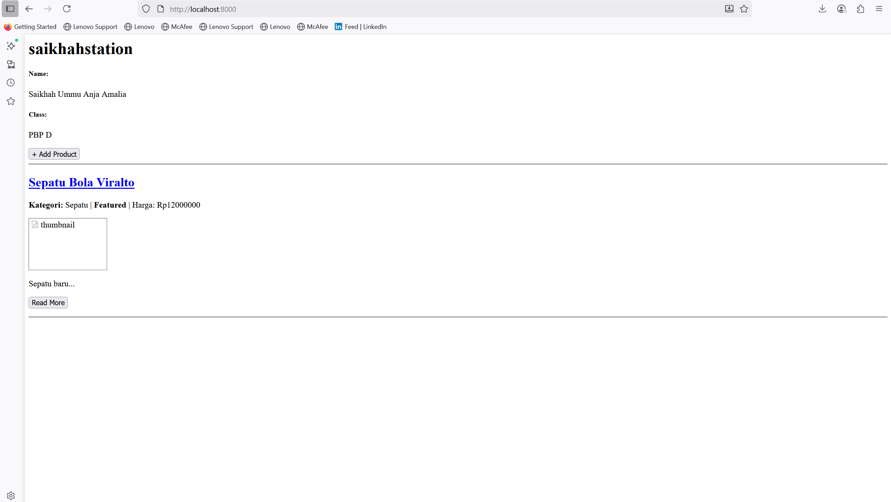

Tugas 2:
1. Jelaskan bagaimana cara kamu mengimplementasikan checklist di atas secara step-by-step (bukan hanya sekadar mengikuti tutorial).
   Jawab: 
   pada tahap awal, saya membuat repositori baru di github dengan nama saikhahstation untuk menyimpan seluruh kode proyek. setelah itu, saya menyiapkan lingkungan kerja dengan menginstal django serta beberapa dependensi lain yang dibutuhkan. selanjutnya, saya membuat proyek django bernama saikhahstation sekaligus menambahkan aplikasi utama bernama main. di aplikasi tersebut, saya mulai mendefinisikan model yang relevan dengan kebutuhan proyek, seperti model produk yang memuat atribut nama, harga, deskripsi, kategori, dan lain-lain.

   setelah model selesai dibuat, saya menghubungkannya dengan view agar data dapat diproses dan kemudian ditampilkan melalui template. saya juga menyusun konfigurasi routing dengan menambahkan path pada urls.py, sehingga setiap permintaan dari pengguna dapat diarahkan ke view yang sesuai. untuk memastikan aplikasi berjalan dengan baik, saya melakukan migrasi basis data dan menjalankan server secara lokal, lalu memverifikasi bahwa halaman dapat diakses melalui browser.

   tahap berikutnya adalah pengaturan variabel lingkungan. saya membuat berkas .env untuk kebutuhan pengembangan lokal dan menyiapkan konfigurasi berbeda untuk mode produksi. dengan cara ini, proyek tetap aman dan fleksibel, baik saat dijalankan di komputer pribadi maupun ketika dideploy ke server. setelah semuanya selesai, saya melakukan commit perubahan, mendorongnya ke github, dan menyiapkan proses deployment agar aplikasi saikhahstation dapat diakses melalui alamat publik.

   sebagai rangkuman, langkah-langkah yang saya lakukan dapat diuraikan sebagai berikut:
        1.	membuat repositori baru di github dengan nama saikhahstation.
        2.	menginstal django.
        3.	membuat proyek django bernama saikhahstation.
        4.	menambahkan aplikasi utama bernama main.
        5.	mendefinisikan model produk pada models.py.
        6.	menghubungkan model dengan view dan template.
        7.	mengatur routing di urls.py agar request terhubung ke view.
        8.	menjalankan migrasi basis data.
        9.	menguji aplikasi dengan server lokal melalui browser.
        10.	menyiapkan variabel lingkungan untuk konfigurasi lokal dan produksi.
        11.	melakukan commit dan push ke github.
        12.	menyiapkan deployment agar aplikasi dapat diakses secara publik.

2. Buatlah bagan yang berisi request client ke web aplikasi berbasis Django beserta responnya dan jelaskan pada bagan tersebut kaitan antara urls.py, views.py, models.py, dan berkas html.
   Jawab:
   
   
   Penjelasannya:
   - urls.py berfungsi sebagai pemetaan (routing) yang menghubungkan permintaan dari client ke fungsi yang sesuai pada views.py.
   - views.py bertugas memproses logika aplikasi sesuai permintaan, misalnya mengambil data dari basis data atau memanggil fungsi tertentu.
   - models.py berisi definisi struktur basis data dalam bentuk kelas. View dapat memanfaatkan model untuk melakukan operasi CRUD (Create, Read, Update, Delete) pada basis data.
   - Template HTML digunakan untuk merender data yang diproses view sehingga dapat ditampilkan kembali ke pengguna.
   - Hasil akhirnya adalah response berupa halaman web yang dikembalikan ke client.

3. Jelaskan peran settings.py dalam proyek Django!
   Jawab:
   dalam proyek django, berkas settings.py berperan sebagai pusat konfigurasi utama yang menentukan bagaimana aplikasi dijalankan, baik pada lingkungan pengembangan maupun produksi. file ini memuat berbagai pengaturan penting, seperti daftar aplikasi yang digunakan (installed apps), middleware, konfigurasi basis data, direktori template, hingga pengaturan keamanan seperti secret key dan allowed hosts. dengan kata lain, settings.py menjadi fondasi yang mengatur interaksi antar-komponen dalam proyek django.

   pada proyek saikhahstation, saya memanfaatkan settings.py untuk menghubungkan aplikasi dengan database, menambahkan aplikasi main ke dalam INSTALLED_APPS, serta mengatur template dan routing agar dapat berjalan dengan benar. selain itu, saya juga menambahkan logika pemilihan konfigurasi berdasarkan environment variables sehingga proyek dapat membedakan mode pengembangan dan produksi. hal ini menjadikan settings.py tidak hanya sebagai file konfigurasi standar, tetapi juga sebagai sarana untuk menjaga fleksibilitas dan keamanan aplikasi.

4. Bagaimana cara kerja migrasi database di Django?
   Jawab:
   migrasi merupakan mekanisme untuk menyesuaikan struktur basis data dengan model yang didefinisikan pada models.py. proses ini dilakukan dalam dua tahap:
	1.	perintah python manage.py makemigrations menghasilkan berkas migrasi berdasarkan perubahan model.
	2.	perintah python manage.py migrate mengeksekusi migrasi tersebut sehingga struktur basis data diperbarui sesuai model.

5. Menurut Anda, dari semua framework yang ada, mengapa framework Django dijadikan permulaan pembelajaran pengembangan perangkat lunak?
   Jawab:
   menurut saya alasan Django dipilih sebagai framework awal dalam pembelajaran pengembangan perangkat lunak karena menggunakan bahasa Python yang relatif mudah dipelajari. selain itu, Django menyediakan berbagai fitur bawaan seperti ORM, autentikasi, dan admin panel sehingga mahasiswa dapat lebih cepat memahami alur pengembangan aplikasi web secara menyeluruh. dokumentasi Django yang lengkap dan komunitas yang luas juga memudahkan proses pembelajaran. framework ini menerapkan konsep MVT yang melatih mahasiswa berpikir terstruktur dalam membangun aplikasi.

6. Apakah ada feedback untuk asisten dosen tutorial 1 yang telah kamu kerjakan sebelumnya?
   Jawab:
   tidak ada. 

Tugas 3:
1. Jelaskan mengapa kita memerlukan data delivery dalam pengimplementasian sebuah platform?
   Jawab:
   Data delivery adalah proses pengiriman data dari satu titik ke titik lain dalam sebuah sistem, sering kali dari server ke klien (misalnya, browser atau aplikasi seluler) atau antar microservices. Kita memerlukannya dalam pengimplementasian platform karena:
      - Menghubungkan Frontend dan Backend: Tanpa data delivery, frontend (antarmuka yang dilihat pengguna) tidak bisa mendapatkan data dari backend (logika bisnis dan database). Misalnya, sebuah aplikasi e-commerce tidak bisa menampilkan daftar produk atau riwayat pesanan tanpa proses ini.
      - Komunikasi Antar Komponen: Dalam arsitektur modern seperti microservices, data delivery memungkinkan berbagai layanan yang independen untuk berkomunikasi dan berbagi informasi. Misalnya, layanan pembayaran perlu mengirim data ke layanan manajemen stok untuk memperbarui jumlah produk yang tersedia.
      - Sinkronisasi dan Real-time Updates: Data delivery memungkinkan platform untuk memberikan pembaruan secara real-time. Contohnya adalah notifikasi, chat, atau pembaruan skor langsung di aplikasi olahraga. Tanpa ini, pengguna harus me-refresh halaman secara manual untuk melihat data terbaru.

2. Menurutmu, mana yang lebih baik antara XML dan JSON? Mengapa JSON lebih populer dibandingkan XML?
   Jawab: 
   Menurut saya, JSON (JavaScript Object Notation) lebih baik untuk sebagian besar kasus dalam pengembangan web modern, dan ini juga yang membuatnya lebih populer daripada XML (eXtensible Markup Language).

   Alasan mengapa JSON lebih populer adalah:
   - Sintaks yang Ringkas dan Mudah Dibaca: Sintaks JSON menggunakan kurung kurawal {} dan kurung siku [] yang mirip dengan objek JavaScript, membuatnya sangat mudah dibaca dan ditulis oleh manusia. Sebaliknya, XML menggunakan tag <element> yang sering kali lebih panjang dan bertele-tele.
   - Ukuran File yang Lebih Kecil: Karena sintaksnya yang ringkas, file JSON cenderung memiliki ukuran yang lebih kecil dibandingkan XML untuk data yang sama. Ini penting untuk menghemat bandwidth dan mempercepat waktu pemuatan.
   - Integrasi Native dengan JavaScript: JSON dinamai berdasarkan JavaScript. Ini berarti bahasa ini memiliki dukungan native untuk parsing JSON, sehingga pengembang dapat mengonversinya menjadi objek JavaScript dan sebaliknya dengan mudah.
   - Struktur Data yang Fleksibel: JSON mendukung struktur data dasar seperti objek, array, string, angka, dan boolean, yang sangat cocok untuk merepresentasikan data yang kompleks dan hierarkis.

   Meskipun XML masih relevan di beberapa bidang (misalnya, SOAP, RSS, dan beberapa konfigurasi industri), JSON telah menjadi standar de facto untuk pertukaran data di web karena kepraktisan dan efisiensinya.

3. Jelaskan fungsi dari method is_valid() pada form Django dan mengapa kita membutuhkan method tersebut?
   Jawab: 
   Metode is_valid() adalah metode krusial pada objek form di Django. Fungsinya adalah untuk memvalidasi data yang dikirimkan melalui form.
   Kita memerlukannya karena:
   - Pencegahan Data Rusak: Metode ini memastikan bahwa data yang dikirimkan oleh pengguna sesuai dengan tipe data yang diharapkan, format yang benar, dan memenuhi semua batasan (misalnya, panjang minimal, format email yang valid). Ini mencegah data yang tidak valid atau berbahaya masuk ke database.
   - Keamanan: Validasi ini membantu mencegah serangan dasar seperti Cross-site scripting (XSS) dengan memastikan input pengguna tidak mengandung kode berbahaya.
   - Kemudahan Pengembangan: Daripada harus menulis kode validasi manual untuk setiap field (seperti if request.POST['nama'] == ''...), is_valid() mengotomatisasi seluruh proses validasi berdasarkan definisi field di class Form. Ini membuat kode lebih bersih, terstruktur, dan mudah dikelola.
   - Pengelolaan Error: Jika form tidak valid, is_valid() akan mengembalikan False. Kita bisa mengakses atribut form.errors untuk mendapatkan pesan kesalahan yang spesifik untuk setiap field, yang kemudian dapat ditampilkan kembali kepada pengguna untuk memperbaikinya.

4. Mengapa kita membutuhkan csrf_token saat membuat form di Django? Apa yang dapat terjadi jika kita tidak menambahkan csrf_token pada form Django? Bagaimana hal tersebut dapat dimanfaatkan oleh penyerang? 
   Jawab:
   Kita membutuhkan csrf_token saat membuat form di Django untuk melindungi situs dari serangan Cross-Site Request Forgery (CSRF). CSRF adalah jenis serangan di mana penyerang memaksa pengguna yang sudah terautentikasi untuk mengirimkan permintaan HTTP berbahaya ke situs web yang rentan. Contohnya, mengirim permintaan untuk mengganti email atau melakukan transfer uang tanpa sepengetahuan pengguna.

   Apa yang Terjadi Jika Tidak Menggunakan csrf_token?
   Jika kita tidak menambahkan  pada form, Django tidak akan dapat memvalidasi permintaan POST dari pengguna. Ini membuat situs web rentan terhadap serangan CSRF.

   Bagaimana Serangan CSRF Terjadi?
   1. Pengguna A masuk ke situs bank (misalnya, bank.com) dan sesi autentikasinya disimpan di browser.
   2. Penyerang B membuat sebuah halaman web jahat (evil.com) yang berisi form tersembunyi. Form ini secara otomatis melakukan permintaan POST ke bank.com untuk melakukan transfer uang, lengkap dengan detail rekening penyerang.
   HTML

    <form action="https://bank.com/transfer" method="post">
        <input type="hidden" name="amount" value="1000">
        <input type="hidden" name="to_account" value="rekening_penyerang">
        <input type="submit" value="Kirim" style="display:none;">
    </form>
    

   3. Penyerang B kemudian membujuk Pengguna A untuk mengunjungi evil.com.
   4. Saat Pengguna A mengunjungi evil.com, form tersembunyi akan otomatis terkirim. Karena Pengguna A masih memiliki sesi yang valid di bank.com, browser akan secara otomatis menyertakan cookie sesi pengguna.
   5. Tanpa csrf_token, bank.com akan menganggap permintaan ini sah dan akan memprosesnya, sehingga uang akan terkirim ke rekening penyerang.

   Peran csrf_token dalam Mencegah Serangan:
   Ketika csrf_token digunakan, Django akan menghasilkan sebuah token unik yang dimasukkan sebagai field tersembunyi di dalam form. Ketika form disubmit, Django akan memeriksa apakah token yang dikirimkan oleh browser cocok dengan token yang ada di sesi pengguna. Jika permintaan berasal dari situs eksternal seperti evil.com, mereka tidak akan memiliki akses ke token sesi yang valid, sehingga token yang dikirimkan tidak akan cocok. Django akan menolak permintaan tersebut dengan status 403 Forbidden, efektif mencegah serangan CSRF.

5. Jelaskan bagaimana cara kamu mengimplementasikan checklist di atas secara step-by-step (bukan hanya sekadar mengikuti tutorial).
   Jawab: 
   Pertama, saya mulai dengan membuat model Product di models.py untuk mendefinisikan struktur data yang akan disimpan, misalnya nama produk, harga, dan deskripsi. Setelah itu, saya membuat form di forms.py menggunakan ProductForm agar pengguna bisa menambahkan data produk dengan lebih mudah. Selanjutnya, saya menulis function view di views.py seperti show_main, create_product, show_xml, dan show_json. View ini bertugas untuk mengambil data dari database, memprosesnya, dan mengembalikannya ke user dalam bentuk halaman HTML atau format data seperti XML/JSON. Setelah views siap, saya menghubungkannya melalui urls.py supaya setiap endpoint bisa diakses oleh pengguna, misalnya /create-product/ untuk menambahkan produk atau /json/ untuk melihat data dalam bentuk JSON. Di tahap berikutnya, saya membuat template HTML seperti main.html dan create_product.html untuk menampilkan data ke pengguna. Saya juga menambahkan csrf_token pada form supaya aman dari serangan CSRF. Terakhir, saya melakukan pengecekan apakah form yang di-submit valid dengan memanggil is_valid(). Jika valid, data akan disimpan ke database. Jika tidak valid, form akan ditampilkan kembali dengan pesan error agar pengguna bisa memperbaiki inputnya.

Mengakses keempat URL di poin 2 menggunakan Postman, membuat screenshot dari hasil akses URL pada Postman, dan menambahkannya ke dalam README.md

